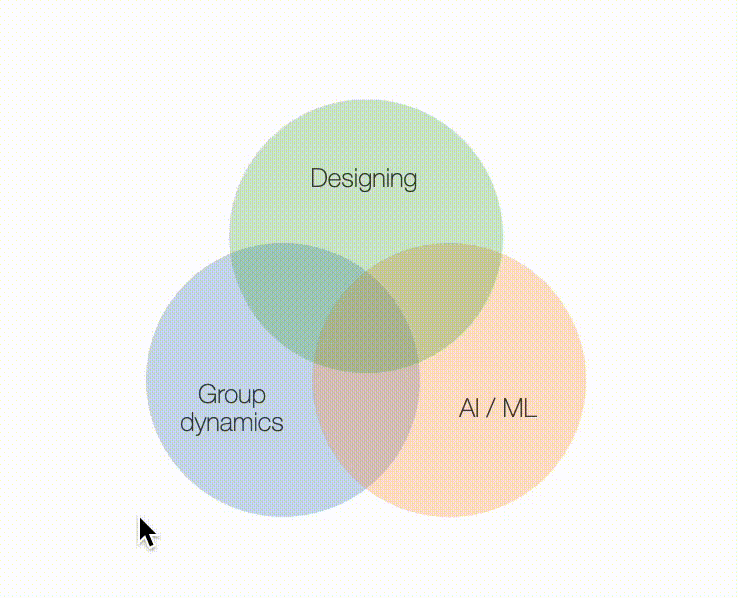

# Venn diagram
An interactive Venn diagram for showcasing your research projects, inspired from [Bjoern Hartmann](https://people.eecs.berkeley.edu/~bjoern/)'s personal website. A tooltip appears when you hover over each section.

This was built upon [D3.js](https://d3js.org/) and [Venn.js](http://benfred.github.io/venn.js/)

## Preview


## Usage
1. Put all the files inside `js` and `css` to your project
2. Import them into your html using the following code

```
<!-- import css -->
<link rel="stylesheet" href="{{ your directory }}/venn-diagram.css">

<!-- import js -->
<script src="https://d3js.org/d3.v5.min.js"></script>
<script src="{{ your directory }}/venn-diagram.js"></script>

<!-- import one of below. the latter one might produce error if your website is secured with HTTPS -->
<script src="{{ your directory }}/venn.js"></script>
<script src="http://benfred.github.io/venn.js/venn.js"></script>
```
3. Customize at `js/venn-diagram.js`
4. Import the following codes at your own html file

```
<div id="venn"></div>
<div id="tooltip"></div>
```
